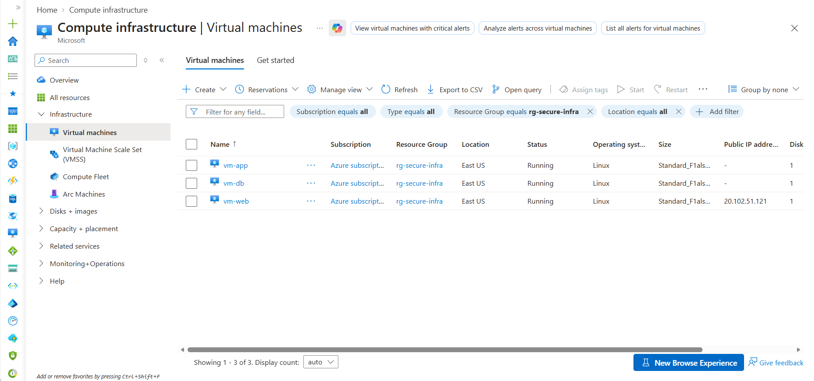

# Secure Three-Tier Azure Infrastructure

A hands-on Azure cloud infrastructure project built with Terraform that demonstrates Infrastructure as Code (IaC), network segmentation, least-privilege access, Linux administration, and secure communication between application tiers.

## Project Overview

This project deploys a segmented three-tier architecture in Microsoft Azure using Terraform.

The environment separates the web, application, and database layers into dedicated subnets and uses Network Security Groups (NSGs) to restrict communication between tiers.

### Architecture

```text
                    Internet
                       |
                    HTTP :80
                       |
                +-------------+
                |   Web Tier  |
                |   Nginx     |
                |   vm-web    |
                | 10.20.1.0/24|
                +-------------+
                       |
                  TCP 5000 only
                       |
                +-------------+
                |  App Tier   |
                | Flask API   |
                |   vm-app    |
                | 10.20.2.0/24|
                +-------------+
                       |
                  TCP 5432 only
                       |
                +-------------+
                | Database    |
                | PostgreSQL  |
                |   vm-db     |
                | 10.20.3.0/24|
                +-------------+
```

## Technologies Used

- Microsoft Azure
- Terraform
- Azure Virtual Network
- Azure Virtual Machines
- Azure Bastion
- Network Security Groups
- Linux / Ubuntu
- Nginx
- Python / Flask
- psycopg2
- PostgreSQL
- Azure CLI
- Git / GitHub

## Network Design

The Azure virtual network is segmented into three subnets:

| Tier | Subnet | Purpose |
|---|---|---|
| Web | `10.20.1.0/24` | Public-facing Nginx web tier |
| Application | `10.20.2.0/24` | Private Flask application tier |
| Database | `10.20.3.0/24` | Private PostgreSQL database tier |

Only the web tier is directly exposed to inbound Internet traffic.

The application and database tiers communicate over private Azure networking.

## Security Controls

Network Security Groups enforce communication boundaries between tiers.

- Internet traffic is permitted to the web tier on TCP port 80.
- SSH administrative access to the web tier is restricted to a specific source IP.
- Web-to-application traffic is restricted to TCP port 5000.
- Application-to-database traffic is restricted to PostgreSQL TCP port 5432.
- Web-to-database traffic on TCP port 5432 is explicitly blocked.
- App and Database NSGs include explicit VNet deny rules to override Azure's default `AllowVNetInBound` behavior.
- The application and database VMs do not expose public-facing application endpoints.
- Terraform state files, variable files containing sensitive values, and local Terraform directories are excluded from source control.

This design reduces unnecessary exposure and demonstrates network segmentation and least-privilege access.

### Azure Bastion and Network Security

Deployed Azure Bastion using Terraform to provide a private administrative access path to Azure virtual machines without exposing public SSH endpoints on the application and database tiers.

Configured Network Security Groups (NSGs) to allow SSH traffic on TCP port 22 from the Azure Bastion subnet (`10.20.20.0/26`) while maintaining explicit deny rules for other virtual-network inbound traffic.

Verified the deployed security rules using Terraform and Azure CLI.

## Application Flow

A request travels through the environment as follows:

```text
Client
  |
  v
Nginx Web Server
  |
  | TCP 5000
  v
Flask Application
  |
  | TCP 5432
  v
PostgreSQL Database
```

Nginx acts as the public-facing reverse proxy and forwards `/api/` requests to the Flask application running on the private application tier.

The Flask application uses `psycopg2` to communicate with PostgreSQL on the private database tier.

## Validation

The deployed environment was validated at both the network and application layers.

Network connectivity testing confirmed the intended segmentation:

- Web → Application on TCP/5000: allowed
- Application → Database on TCP/5432: allowed
- Web → Database on TCP/5432: blocked

The public Nginx endpoint was then used to validate the complete application path.

Health endpoint:

```text
GET /api/health

{"status":"healthy"}
```

Database-backed endpoint:

```text
GET /api/database

{
  "database": "connected",
  "project": "Secure Azure Infrastructure",
  "status": "Operational"
}
```

The `/api/database` request follows the complete path:

```text
Internet
   |
   v
Nginx (Web Tier)
   |
   | TCP/5000
   v
Flask API (Application Tier)
   |
   | TCP/5432
   v
PostgreSQL (Database Tier)
```

The response is generated from data retrieved by the Flask application from PostgreSQL, validating functional communication across all three tiers while maintaining network segmentation.

## Implementation Screenshots

### Azure Three-Tier Virtual Machines

The Azure virtual machines view shows all three Linux VMs in the `rg-secure-infra` resource group running at the time of capture. Only the public-facing `vm-web` has a public IP address; `vm-app` and `vm-db` have no public IP addresses listed.



## Infrastructure as Code

Terraform is used to define and deploy the Azure infrastructure, including:

- Resource group
- Virtual network
- Three application subnets
- Network Security Groups
- NSG security rules
- NSG-to-subnet associations
- Network interfaces
- Linux virtual machines
- Public IP resources
- Infrastructure outputs
- Resource tagging

Terraform provides a repeatable deployment process and keeps the infrastructure configuration version-controlled.

## Prerequisites and Deployment

To reproduce this learning environment, you need:

- An Azure subscription with permission to create networking, virtual machine, NAT Gateway, and Azure Bastion resources. These services may incur charges.
- [Terraform](https://developer.hashicorp.com/terraform/install) **1.7.0 or later** and the [Azure CLI](https://learn.microsoft.com/en-us/cli/azure/install-azure-cli).
- An SSH public key at `~/.ssh/id_rsa.pub`, as referenced in `main.tf` (or an updated path to your own public key).
- Values for Terraform's required `admin_source_ip` (trusted public IP/CIDR for Web-tier SSH, such as a `/32`) and sensitive `db_password`. Supply secrets interactively or through a local, Git-ignored variable file; do not commit them.

From the repository directory, authenticate to the intended Azure subscription and review the proposed deployment:

```powershell
az login
az account set --subscription "<subscription-id>"
terraform init
terraform validate
terraform plan
terraform apply
terraform output
```

Terraform prompts for required values unless they have been provided securely by another supported method. The VM configuration uses the scripts in `scripts/` as custom data; verify the HTTP health and database-backed endpoints after provisioning.

**Shared-lab caution:** The `vnet-secure-infra` VNet is also used by the [hybrid enterprise identity lab](https://github.com/NigelG100/azure-hybrid-enterprise-lab). When working in an existing lab, inspect `terraform plan` carefully and do not approve unexpected replacements or deletions affecting shared resources.

## Repository Structure

```text
azure-secure-infrastructure/
|
|-- main.tf
|-- bastion.tf
|-- variables.tf
|-- outputs.tf
|-- providers.tf
|
|-- screenshots/
|   |-- azure-three-tier-vms.png
|
|-- scripts/
|   |-- web-setup.sh
|   |-- app-setup.sh
|   |-- db-setup.sh
|
|-- .gitignore
|-- README.md
```

The setup scripts make the application stack reproducible:

- `web-setup.sh` installs and configures Nginx as a reverse proxy to the private application tier.
- `app-setup.sh` installs Flask and `psycopg2`, deploys the API, configures PostgreSQL connectivity, and runs the application as a systemd service.
- `db-setup.sh` configures PostgreSQL network access, creates the application role and database, initializes the `project_status` table, and grants the required permissions.

Database credentials are supplied at runtime rather than stored directly in the committed setup scripts. Local Terraform variable files containing sensitive values are excluded through `.gitignore`.

## Key Skills Demonstrated

- Azure infrastructure deployment
- Infrastructure as Code with Terraform
- Azure virtual networking
- Subnet segmentation
- Network Security Groups
- Linux server administration
- Nginx reverse proxy configuration
- Python / Flask API deployment
- PostgreSQL configuration and connectivity
- Private tier-to-tier communication
- Azure CLI administration
- Git / GitHub version control
- Network and application troubleshooting
- End-to-end infrastructure validation

## Future Improvements

Potential enhancements include:

- Azure Key Vault for centralized secret management
- HTTPS/TLS termination
- Azure Monitor and Log Analytics
- Remote Terraform state using Azure Storage
- CI/CD deployment through GitHub Actions
- Terraform modules for reusable infrastructure components
- Application Gateway and Web Application Firewall

## Purpose

This project was built as a hands-on cloud engineering and security portfolio project to demonstrate the ability to deploy, secure, troubleshoot, and validate a multi-tier Azure environment using Infrastructure as Code.